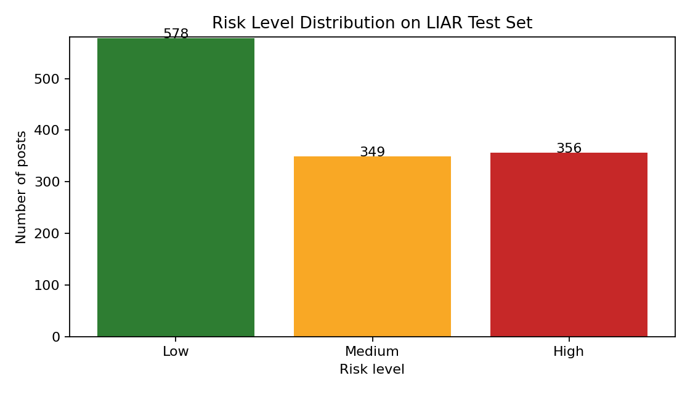

# ENGG1910 Demystifying Artificial Intelligence Course Project Report

## Project Title: AI-Powered Misinformation Risk Assistant for Social Media Users

## Abstract

This project designs an AI-powered misinformation risk assistant for social media users. Instead of directly judging whether a post is true or false, the system estimates whether a post has a higher risk of containing misleading information and explains the warning signals behind the score. The prototype uses natural language processing and metadata-based features to analyze short claims. We tested the idea on the LIAR dataset, a public benchmark containing 12.8K manually labelled political statements from PolitiFact. LIAR's six truthfulness labels were mapped into a binary risk task: `false`, `barely-true`, and `pants-fire` were treated as higher-risk claims, while `half-true`, `mostly-true`, and `true` were treated as lower-risk claims. A TF-IDF logistic regression baseline achieved 0.743 accuracy, 0.712 F1 score, and 0.831 ROC-AUC on the test set. We also implemented a compact BERT-style transformer experiment. The result suggests that AI can support users by prioritizing posts for checking, but it should not replace human judgment or professional fact-checking.

## 1. Introduction

Misinformation spreads quickly on social media because users often see short, emotional, and highly shareable posts before they have time to verify them. A simple true-or-false AI detector is risky because many real posts are ambiguous, incomplete, satirical, or still developing. A wrong automatic judgment may also create problems for freedom of expression. Therefore, our project focuses on a safer goal: estimating misinformation risk and giving reasons for caution.

The target user is an ordinary social media user who is deciding whether to trust or share a post. The system receives a post and available contextual information, then returns a risk score, a risk level, and explanation messages. The purpose is to encourage critical thinking, such as checking official sources or reading fact-checking reports, rather than letting AI become the final authority.

## 2. Main Problem

The main problem is to identify claims that deserve further checking. This is not the same as proving a claim false. In real social media settings, a post may be misleading because it uses exaggerated wording, removes context, comes from a weak source, or spreads through suspicious repost patterns. The system should combine text signals and context signals to estimate risk.

For this prototype, we formulate the problem as binary classification. Each claim is represented by text features and metadata features. The output is the probability that the claim belongs to the higher-risk class. The probability is then converted into three user-facing levels: Low risk, Medium risk, and High risk.

## 3. Data Requirement and Preparation

For the real experiment, we used the LIAR dataset referenced on Hugging Face and originally introduced by Wang. LIAR contains short political statements collected from PolitiFact and labelled by human fact-checkers using six categories: `false`, `half-true`, `mostly-true`, `true`, `barely-true`, and `pants-fire`. It also includes metadata such as speaker, subject, party affiliation, context, and the speaker's previous fact-checking history.

The dataset was downloaded as the original TSV files. We used the official training and validation files together for model training, and kept the official test file for final evaluation. The training size was 11,553 claims and the test size was 1,283 claims. To match our risk-assistant design, we mapped `false`, `barely-true`, and `pants-fire` to the higher-risk class, and mapped `half-true`, `mostly-true`, and `true` to the lower-risk class. This mapping is a simplification, but it is suitable for a prototype because the output is a risk warning rather than a final truth verdict.

## 4. Application Design

The proposed system has four major modules. First, the input module collects a social media post, attached links, source information, account information, and repost information when available. In the LIAR experiment, the available inputs are the statement, subject, speaker, context, and speaker history.

Second, the feature extraction module converts the input into machine-readable representations. The text is processed by TF-IDF with unigrams and bigrams, which captures important words and short phrases. The system also computes engineered features, including emotional wording, unsupported claim markers, source risk, account age, repost velocity, and possible coordination. For the LIAR dataset, social media network features are not available, so the strongest metadata feature is the speaker's past fact-checking history.

Third, the learning module contains two model options. The first is logistic regression, which is efficient, interpretable, and works well with sparse TF-IDF features. The second is a transformer-based classifier using a compact BERT-style model. The transformer reads a tokenized sentence with self-attention layers and fine-tunes a classification head for the risk task. Both models output a probability between 0 and 1, where a higher value means the post is more likely to require careful checking.

Fourth, the explanation module converts signals into readable comments. For example, it may warn that the text contains emotional wording, unsupported claim markers, or that the speaker has a high-risk fact-checking history. This is important because users should understand why a post is flagged instead of blindly trusting an AI score.

## 5. Experimental Results and Observations

On the LIAR test set, the TF-IDF logistic regression baseline achieved an accuracy of 0.743, precision of 0.692, recall of 0.732, F1 score of 0.712, and ROC-AUC of 0.831. The confusion matrix contained 546 true negatives, 181 false positives, 149 false negatives, and 407 true positives. These results show that the model can identify many higher-risk claims, but still makes both types of mistakes.

The transformer experiment fine-tuned `prajjwal1/bert-tiny` on 2,000 training examples for five epochs on CPU. It achieved 0.609 accuracy, 0.456 F1 score, and 0.631 ROC-AUC. This was weaker than the baseline, probably because the model was very small and trained with limited data and computing resources. This observation is useful: a more complex AI model is not automatically better unless it has enough data, training time, and tuning.

Figure 1 shows the distribution of risk levels predicted on the LIAR test set. The system classified 578 posts as Low risk, 349 as Medium risk, and 356 as High risk. This distribution is useful for a real application because it does not simply block or approve content. Instead, it creates a priority queue: high-risk posts should be checked first, medium-risk posts should be read carefully, and low-risk posts can be treated as less urgent.

One observation is that metadata improves practical usefulness. In several high-risk examples, the explanation noted that the speaker had a high-risk fact-checking history. Another observation is that some claims receive high scores without obvious emotional wording. This means the classifier may learn statistical patterns that are not easy to explain using simple rules. Therefore, explanation design remains an important challenge.

## 6. Challenges and Reflection

The first challenge is bias. Political fact-checking datasets may reflect the topics, speakers, and media environment of their original collection process. A model trained on LIAR may not generalize well to health misinformation, financial scams, or local rumors.

The second challenge is privacy. A real social media assistant might use account age, repost behavior, and user interaction records. These features may improve detection, but they also create privacy risks. The system should collect only necessary metadata and avoid storing private user behavior when possible.

The third challenge is adversarial behavior. People who spread misinformation can avoid obvious emotional words, change wording, use screenshots, or create coordinated accounts. Therefore, the system should be updated regularly and combined with human fact-checking.

The fourth challenge is over-trust. Users may treat a low-risk score as proof that a claim is true. To reduce this risk, the interface should state clearly that the output is only a warning level. The system should recommend actions such as checking official sources, reading the full article, and comparing multiple reliable reports.

## 7. Conclusion

This project demonstrates a practical AI application for misinformation risk assistance. By combining NLP features, metadata features, machine learning, and explainable warnings, the system can help users decide which posts require more careful verification. The LIAR experiment shows that even a simple logistic regression model can achieve reasonable performance on a public fact-checking dataset. However, the system should be understood as a decision-support tool, not an automated truth judge. Future work should include larger social media datasets, multilingual posts, link analysis, network propagation features, and user studies to test whether the assistant actually improves sharing behavior.

## References

[1] W. Y. Wang, "Liar, Liar Pants on Fire: A New Benchmark Dataset for Fake News Detection," Proceedings of the 55th Annual Meeting of the Association for Computational Linguistics, 2017. https://aclanthology.org/P17-2067/

[2] Hugging Face, "ucsbnlp/liar Dataset Repository." https://huggingface.co/datasets/ucsbnlp/liar

[3] PolitiFact, "Fact-checking political claims." https://www.politifact.com/
